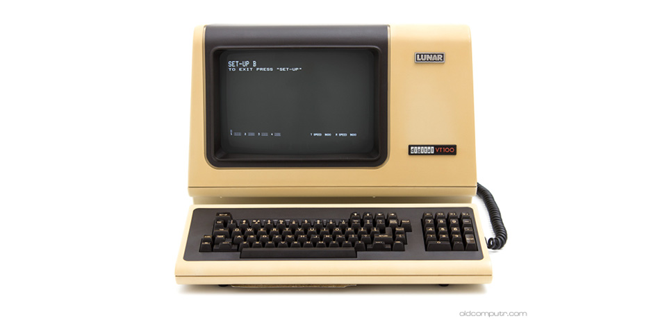
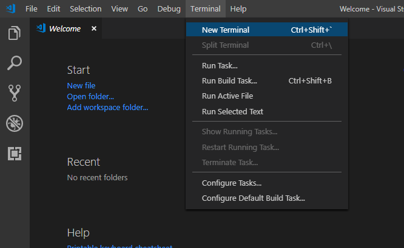
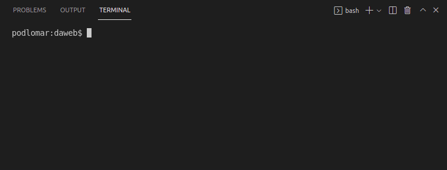
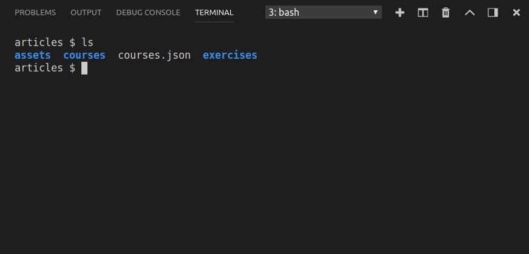

V této části si ukážeme, jakým způsobem budeme jako programátoři s počítačem komunikovat. Zatím jste nejspíše zvyklí ovládat svůj počítač pomocí různých okýnek, ikonek, grafických čudlíků apod. Takový způsob je ovšem pro programátory mnohdy zbytečně omezující a zdlouhavý. Často je mnohem jednodušíí s počítačem komunikovat textově pomocí takzvaného _terminálu_.

Počítačový terminál je zařízení, které má počátky ve 40. a 50. letech. Tehdy vypadal jako elektrický psací stroj a používal se k posílání textových příkazů do počítače, který byl v těchto dobách velký jako kuchyňská linka. Později terminály získaly obrazovky, podobně jako ten na obrázku z roku 1978, takže už se výsledky počítače nemusely tisknout přímo na papír.



Možná vám to přijde neuvěřitelné, ale i v době, kdy se nám počítače vejdou do kapsy a máme úžasné grafické dotykové obrazovky, pro programátory je často nejrychlejší a nejpřehlednější zadávat příkazy textově jako na starých terminálech. Jediný rozdíl je dnes v tom, že terminál už není fyzické zařízení. Je to prostě program, který si spustíte na svém počítači, a hned vypadáte jako hackeři z nějakého béčkového filmu.

V našem případě máme život jednoduchý, protože Visual Studio Code má terminál zabudovaný přímo v sobě. Spustíte jej tak, že ve VS Code v horním menu zvolíte <i>Terminal → New Terminal</i>.

{.fig .fig-100}

Okno terminálu po otevření vypadá podobně, jako kdybyste používali skutečný fyzický terminál ze sedmdesátých let. Vidíte v něm velký bílý kurzor a před ním jakýsi kus textu, který ve vašem terminálu nejspíše vypadá jinak než v tom na obrázku.

{.fig .fig-100}

Po otevření terminálu se v něm ihned spustí takzvaný _shell_, což je program, který vykonává vaše textové příkazy a vypisuje jejich výsledky. Zde se opět dostáváme trochu do potíží, protože každý operační systém má svůj vlastní shell. To je důvod proč před kurzorem nejspíše vidíte něco jiného než na obrázku. Ve Windows se používá shell jménem _cmd_, na Linuxu máme _bash_, MacOS používal také bash, nedávno ale přesedlal na shell jménem _zsh_. V horní liště mého terminálu vidíte, že můj shell je bash. Mám jej nastavený tak, aby před kurzorem zobrazoval název složky, ve které se zrovna nacházím. Vy tam pravděpodobně máte celou cestu ke složce, ve které se vám terminál otevřel.

### Shell příkazy

Pokud pracujete na Windows, možná v horní liště terminálu vidíte název PowerShell. To je nový modernější shell od Microsoftu, my jej však používat nebudeme. Zkuste proto z nabídky vybrat shell jménem cmd.

Nyní můžeme zkusit našemu shellu poslat nějaký příkaz. Nejdříve budeme chtít vidět obsah složky, ve které se právě nacházíme. Pokud jste v shellu cmd, napište do termínálu `dir` a stiskněte [[Enter]]. Pokud máte bash nebo zsh, příkaz se jmenuje `ls`. V mém případě vypadá výsledek takto.

{.fig .fig-100}

Později v kurzu budeme psát příkazy i jinam než do shellu. Pokud tedy bude potřeba zadat nějaký příkaz přímo v shellu, naznačíme to symbolem dolaru, například takto:

```shell
$ dir
```

Dolar se do shellu nepíše. Z toho důvodu je také barevně odlišen od samotného příkazu. Často také budeme příkazy zobrazovat i s jejich výsledky, které už dolarem nezačínají. To znamená, že je do terminálu nepíšeme, jsou zde vypsány jen pro naši informaci. Výsledek příkazu `ls` pak může vypadat třeba takto.

```shell
$ ls
assets courses courses.json exercises
```

Pozor na to, že `ls` funguje jen v bashi, tedy pouze na Linuxu a MacOS, ve Windows je třeba psát `dir`.

## Navigování mezi složkami

Každý shell má mnoho příkazů, pomocí kterých můžete dělat věci jako kopírovat soubory, vytvářet složky, pracovat se sítí apod. My v tomto kurzu budeme shell používat jen málo, protože si chceme povídat především s JavaScriptem. V této části se tedy z shellu naučíme jen to nejdůležitější a to je přecházení mezi složkami.

Je dobré si zapamatovat, že shell je vždy otevřený uvnitř nějaké složky. Cestu ke složce, ve které se právě nacházíte byste měli vidět před kurzorem. Pokud se chcete přesunout do jiné složky, použijete příkaz `cd`, který zrovna náhodou funguje úplně ve všech shellech.

Já jsem si pro účely této lekce otevřel terminál ve složce `articles`. Pomocí příkazu `ls` nebo `dir` jsem zjistil, že uvnitř této složky je mimo jiné i složka `courses`. Přesunu se do ní tedy příkazem `cd` a nechám si vypsat její obsah.

```shell
$ ls
assets courses courses.json exercises
$ cd courses
$ ls
daweb python-data
```

Nyní se můžu příkazem `cd` přesunout opět do nějaké složky, kterou vidím na obrazovce, nebo se můžu rozhodnout vrátit do nadřazené složky takto

```shell
$ cd ..
$ ls
assets courses courses.json exercises
```

Tímto způsobem se můžu zcela svobodně přesouvat mezi složkami na pevném disku.

### Tabulátor a historie

Občas jsou názvy složek dlouhé a nechce se nám je celé vypisovat. Zkuste při použití příkazu `cd` napsat jen prvních pár písmenek z názvu složky a stiskněte klávesu [[Tab]]. Shell by měl sám doplnit zbytek názvu.

Často se nám také hodí vrátit se k příkazům, které jsme napsali před chvíli. Pokud v terminálu stisknete šipku nahoru [[↑]], můžete postupně procházet všechny příkazy, které jste do shellu napsali.

Všechny výše zmíneně postupy budeme používat především proto, abychom dokázali ovládat Git, případně interagovali s balíčkovacím systémem NPM.

## Lovení speciálních znaků

Při práci s terminálem ale především během programování budeme často potřebovat napsat různé speciální znaky, které jste možná v životě nikdy nepotřebovali, například složené závorky `{}`, roura `|`, dolar `$` apod. Tyto znaky může být občas těžké na klávesnici najít v závislosti na tom, jaké rozložení klávesnice používáte. V podstatě existují dvě hlavní možnosti.

### Používat českou klávesnici

Všechny důležité speciální znaky lze napsat na českém QWERTZ rozložení klávesnice za pomoci klávesy [[Alt Gr]] (pravý Alt). Například levá složená závorka se napíše jako [[Alt Gr]] + [[B]]. Následující [plánek](assets/keyboard-cs-en.pdf) by vám měl pomoci najít na českém rozložení všechny znaky, které budete potřebovat. Jen pozor, že pokud máte české rozložení ve variantě QWERTY, zkratky používající [[Alt Gr]] vám pravděpodobně fungovat nebudou.

### Přepínat mezi českou a anglickou klávesnicí

Druhá možnost je během programování přepínat mezi českou a anglickou klávesnicí. Zde je výhoda v tom, že většina důležitých speciálních znaků se na anglické klávesnici nachází v horní řadě tam, kde jsou běžně písmenka s diakritikou, opět viz [plánek](assets/keyboard-cs-en.pdf). Drobná potíž spočívá v tom, že na české a anglické klávesnizi se liší pozice písmen [[Y]] a [[Z]]. Proto je lepší používat české rozložení ve variantě QWERTY. V takovémto případě je také dobré naučit se zkratku pro přepínání mezi klávesnicemi. Ve Windows to bývá většinou [[Alt]] + [[Shift]].

@exercises[

- klavesova-zviratka
  ]@

## Shrnutí

V této lekci jsme

- poznali co je to terminál a k čemu se nám hodí,
- naučili se základní příkazy v shellech jako cmd nebo bash,
- zorientovali se na klávesnici a naučili se psát spoustu divných ale užitečných znaků.
