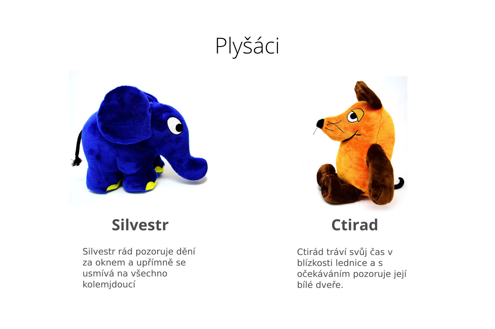

Vytvořte v Reactu webovou stránku dle následujícího vzoru.

{.fig .fig-100}

Postupujte dle následujících kroků.

1. Založte nový React projekt.
1. Upravte obsah stránky tak, aby vypadal takto.
   ```html
   <h1>Plyšáci</h1>
   <div className="plushies"></div>
   ```
   Uložte si toto JSX do seperátní proměnné. Nezapomeňte jej správně obalit do fragmentu. Tuto proměnnou pak použíjte ve funkci `render`.
1. Vytvořte si dva objekty obsahující informace o plyšácích dle následujícího vzoru.
   ```js
   const plushy1 = {
     name: 'Silvestr',
     image: 'adresa obrazku',
     text: 'Silvestr rád pozoruje dění za oknem a upřímně se usmívá na všechno kolemjdoucí.',
   };
   const plushy2 = {
     name: 'Ctirad',
     image: 'adresa obrazku',
     text: 'Ctirad tráví svůj čas v blízkosti lednice a s očekáváním pozoruje její bílé dveře.',
   };
   ```
1. Adresy obrázků si můžeme zkopírovat z těcho odkazů: [elephant](assets/elephant.jpg), [mouse](assets/mouse.jpg).
1. Karta s plyšákem by měla ve výsledné stránce vypadat takto.
   ```html
   <div class="plushy">
     
     <h2 class="plushy__name">Jméno plyšáka</h2>
     <p class="plushy__text">Text o plyšákovi</p>
   </div>
   ```
   Převeďte tento kód na JSX a vložte jej do elementu `.plushies`, jednou pro každého plyšáka. Nezapomeňte, že v JSX se místo `class` píše `className`. Data pro obě karty vezměte z objektů `plushy1` a `plushy2`.
1. Přidejte do stránky soubor se styly a nastylujte ji dle zadání.
