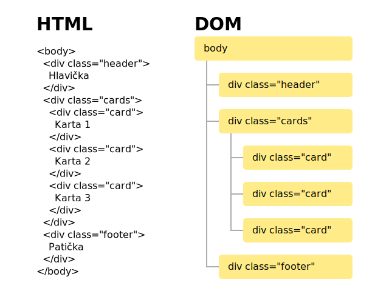
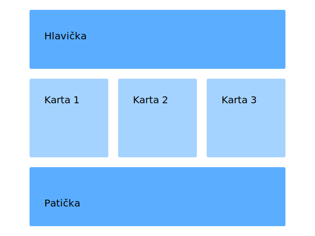

V předchozích lekcích jsme se naučili psát JavaScriptové programy, které už zvládnou hodně věcí a dokážeme napsat i něco skutečně užitečného. Co nám ale zatím chybí je hezká interakce s uživatelem. Budeme chtít, abychom pomocí JavaScriptu dokázali měnit obsah stránky a tak umožnit uživateli opravdu interaktivní zážitek namísto pouhého vypisování textu na obrazovku.

## Document Object Model

K interakci se stránkou pomocí JavaScriptu nám slouží takzvaný DOM, neboli _Document Object Model_. Ten představuje interní reprezentaci webové stránky v paměti prohlížeče. Pojďme si vysvětlit, co to znamená.

Ve chvíli, kdy uživatel zadá do prohlížeče URL adresu, webový prohlížeč pošle po internetu požadavek na server sídlící na této adrese. Server pošle prohlížeči zpátky HTML požadované stránky. Takové HTML může vypadat například takto.

```html
<!DOCTYPE html>
<html lang="en">
  <head>
    <meta charset="UTF-8" />
    <meta name="viewport" content="width=device-width, initial-scale=1.0" />
    <link rel="stylesheet" href="style.css" />
    <title>Document</title>
  </head>
  <body>
    <div class="header">Hlavička</div>
    <div class="cards">
      <div class="card">Karta 1</div>
      <div class="card">Karta 2</div>
      <div class="card">Karta 3</div>
    </div>
    <div class="footer">Patička</div>
  </body>
</html>
```

Prohlížeč si HTML přečte a vytvoří si z něj v paměti stromovou strukturu, která reprezentuje obsah stránky. Této struktuře říkáme DOM a můžeme ji znázornit jako na obrázku níže.



Jakmile má prohlížeč DOM zkonstruovaný, může úplně zapomenout na HTML a stránku zobrazí podle toho, co je obsaženo v DOMu.



Je to podobné, jak když si například čtete knížku a v hlavě si automaticky vytváříte reprezentaci celého příběhu. Později jej tedy dokážete odvyprávět i bez knihy. Výhoda pro nás programátory spočívá v tom, že prohlížeč nám umožní DOM pomocí JavaScriptu měnit a tím ovlivňovat, co se zobrazuje na stránce.

To hlavní, co je dobré si z tého sekce zapamatovat je, že HTML je pouze text, který se za života stránky nikdy nemění, kdežto DOM je vnitřní reprezentace stránky, která se měnit dá.

## DOM Elementy

Když prohlížeč zpracovává HTML kód, každá značka a její obsah se převedou na takzvaný _DOM element_. Každý žlutá krabička na obrázku výše představuje jeden DOM element. Z hlediska JavaScriptu je důležité, že DOM elementy jsou nový typ hodnoty. Můžeme je tedy podobně jako čísla, řetězce nebo pravdivostní hodnoty ukládat do proměnných, předávat jako vstupy funkcím apod. Jak se ale k nějakému DOM elementu z naší stránky dostaneme? Poslouží nám k tomu funkce `document.querySelector`. Pro ukázku použití se vraťme k naší stránce s třemi kartami.

```html
<body>
  <div class="header">Hlavička</div>
  <div class="cards">
    <div class="card">Karta 1</div>
    <div class="card">Karta 2</div>
    <div class="card">Karta 3</div>
  </div>
  <div class="footer">Patička</div>
</body>
```

JavaScript říká DOMu celé naší stránky _dokument_. Funkce `document.querySelector` umí z dokumentu vybrat DOM element podle stejných pravidel, která používají CSS selektory. Například element hlavičky najdeme snadno podle jeho třídy. Výsledný DOM element si pak uložíme do proměnné. Zatím budeme experimentovat v konzoli, abychom si mohli rovnou zobrazit výsledky.

```jscon
> const headerElm = document.querySelector('.header');
> headerElm
<div class="header">Hlavička</div>
```

Jakmile máme element uložený v proměnné, můžeme si s ním začít hrát pomocí jeho vlastností a metod.

### Změny obsahu a stylu

První důležitá vlastnost každého DOM elementu je `textContent`. Ta obsahuje textový obsah našeho elementu. Použitím vlastnosti `textContent` můžeme tento obsah číst a také měnit.

```jscon
> const headerElm = document.querySelector('.header')
> headerElm.textContent
Hlavička
> headerElm.textContent = 'Dobré ráno'
> headerElm
<div class="header">Dobré ráno</div>
```

Snadno také můžeme změnit jakýkoliv styl pomocí vlastnosti `style`. Takto můžeme změnit například barvu textu a dolní okraj.

```jscon
> const headerElm = document.querySelector('.header')
> headerElm.style.color = 'white'
> headerElm.style.marginBottom = '2rem'
```

Všimněte si hned dvou důležitých věcí. Za prvé, názvy CSS vlastností musíme zapisovat **velbloudí notací**. Je to proto, že kdybychom použili kebab notaci (ano, toto je skutečný název) jako zde

```jscon
> headerElm.style.margin-bottom = '2rem'
```

JavaScript by si pomlčku spletl s mínusem a kód by nefungoval. Druhá důležitá věc je, že hodnoty všech CSS vlastností se zapisují pomocí řetězců. Proto dávejte pozor například na takového chyby.

```jscon
> headerElm.style.color = white
> headerElm.style.marginBottom = 2rem
```

### Změna třídy

Pomocí JavaScriptu můžeme také snadno změnit CSS třídu elementu. Použijeme k tomu vlastnost `className`. Můžeme tak například snadno měnit třídy hlavičky na naší stránce.

```jscon
> const headerElm = document.querySelector('.header')
> headerElm
<div class="header">Dobré ráno</div>
> headerElm.className = 'new-header'
> headerElm
<div class="new-header">Dobré ráno</div>
```

U vlastnosti `className` je dobré si dát pozor na to, že se vždy mění celý obsah atributu. Dejme tomu, že mám tlačítko s třídou `btn`.

```html
<button class="btn">Click me</button>
```

Pokud chci tlačítko vzýraznit a přidat mu další třídu například takto

```html
<button class="btn btn-primary">Click me</button>
```

musím nastavit obsah celého atributu `class`.

```jscon
> const buttonElm = document.querySelector('button')
> buttonElm
<button class="btn">Click me</button>
> buttonElm.className = 'btn btn-primary'
> headerElm
<button class="btn btn-primary">Click me</button>
```

### Změna atributů

Podobně jako obsah, třídy nebo styly můžeme měnit i atributy elementů. Nejšikovnější je například změna obrázku v elementu `img`. Mějme například následující HTML.

```html

```

Pomocí JavaScriptu obrázek snadno změníme takto.

```js
const petElement = document.querySelector('.pet');
petElement.src = 'img/dog.jpg';
petElement.alt = 'Pejsek';
```

Vidíte, že díky DOMu si můžeme se stránkou hrát zcela dle libosti. Možná se vám už v hlavně rodí odvážné a nadšené nápady jaké úžasné stránky by se daly tatko vyrobit. Vraťme se však na chvilinku ještě k selektorům.

### Selektory

Vybírat prvky na stránce pomocí CSS tříd se občas velmi hodí. Jindy nás to ale naopak dostává do problémů. Podívejme se znova na kód stránky s kartami.

```html
<body>
  <div class="header">Hlavička</div>
  <div class="cards">
    <div class="card">Karta 1</div>
    <div class="card">Karta 2</div>
    <div class="card">Karta 3</div>
  </div>
  <div class="footer">Patička</div>
</body>
```

Funkce `document.querySelector` vždy vrátí **první** prvek, který na stránce najde. Pokud se chceme dostat například ke druhé kartě, pomocí selectoru `.card` to nepůjde. Takto získáme pouze kartu první.

```js
const cardElm = document.querySelector('.card');
```

Jelikož lze v `document.querySelector` použít libovolný CSS selektor, někoho by mohla napadnout například takováhle frajeřinka.

```js
const cardElm = document.querySelector('.card:nth-child(2)');
```

Tento kód bude skutečně fungovat, ale rovnou zde na místě vám takové triky navždy zakazuju. Takovéto komplikované selektory používejte pouze v případě, že opravdu není vyhnutí. Pro nás existuje jednodušší řešení a to dát každé kartě unikátní `id`.

```html
<body>
  <div class="header">Hlavička</div>
  <div class="cards">
    <div id="card1" class="card">Karta 1</div>
    <div id="card2" class="card">Karta 2</div>
    <div id="card3" class="card">Karta 3</div>
  </div>
  <div class="footer">Patička</div>
</body>
```

Pak se ke druhé kartě snadno dostaneme takto.

```js
const cardElm = document.querySelector('#card2');
```

Používání `id` je vůbec ten nejvychovanější způsob, jak ze stránky něco vybírat, protože je ihned vidět, který prvek máme na mysli a nemusíme řešit žádné CSS hádanky. Dokonce je to tak vychovaný a běžný způsob, že JavaScript poskytuje speciální funkci `document.getElementById`, která vybírá na základě `id`. Kód výše by šel tedy napsat i takto.

```js
const cardElm = document.getElementById('card2');
```

Všimněte si, že zde napíšeme znak mřížky, protože vstupem pro `document.getElementById` není CSS selektor, nýbrž samotné `id` prvku.

Oba z výše uvedených způsobů výběru podle `id` jsou zcela legitimní a je pouze na vás, který si zvolíte.

@exercises ## Cvičení - Manipulace s DOMem [

- novinky
- kviz
  ]@

## Pokročilejší práce s třídami

Představme si nějaký DOM element, který na sobě má navázáno vícero CSS tříd. Například nějaké přepínací tlačíko, které začíná ve stavu 'vypnuto'.

```html
<button id="login-btn" class="btn btn--off btn--primary">Login</button>
```

Dejme tomu, že bychom chtěli prostřední třídu odstranit a tím tlačítko přepnout do stavu 'zapnuto'. Se současnými dovednostmi můžeme udělat například toto.

```js
const btnElm = document.querySelector('#login-btn');
btnElm.className = 'btn btn--primary';
```

Takto ovšem nastavujeme celý atribut `class`. Musíme tedy znát všechny ostatní třídy, které na tlačítku máme. To nám začne časem velmi znepříjmňovat život. JavaScript však nabízí vlastnost `classList`, díky které můžeme s CSS třídami na elementu pracovat mnohem přímočařeji. Výše zmíněný úkol pak vyřešíme takto.

```js
const btnElm = document.querySelector('#login-btn');
btnElm.classList.remove('btn--off');
```

Metoda `remove` udělá veškerou špinavou práci za nás nehledě na to jaké další CSS třídy jsou na element navázány. Pokud chceme naopak třídu přidat, použíjeme metodu `add`.

```js
const btnElm = document.querySelector('#login-btn');
btnElm.classList.add('btn--off');
```

### Přepínání

Naše tlačítko funguje jako přepínač. Chceme, aby například na kliknutí přepnulo stav z 'vypnuto' na 'zapnuto' a obráceně. Což v řeči programátorské znamená: když element obsahuje třídu `btn--off` tak ji odstraň, v opačném případě ji přidej. Takový kód můžeme napsat pomocí metody `contains`.

```js
const btnElm = document.querySelector('#login-btn');
if (btnElm.classList.contains('btn--off')) {
  btnElm.classList.remove('btn--off');
} else {
  btnElm.classList.add('btn--off');
}
```

Přepínání tříd je však tak častá situace, že `classList` má přímo na toto metodu `toggle`. Ta dělá přesně to, co náš kód výše. Můžeme jej tak zkrátit takto.

```js
const btnElm = document.querySelector('#login-btn');
btnElm.classList.toggle('btn--off');
```

Pokud se daná CSS třída na elementu nachází, metoda `toggle` ji odstraní. Pokud tam naopak není, metoda `toggle` ji přidá.

Pomocí vlastnosti `classList` jsme opět rozšířili náš arzenál pro manipulaci s obsahem stránky a také máme život zase o kousek jednodušší.

@exercises ## Doporučené úložky na doma [

- dovednosti
  ]@
