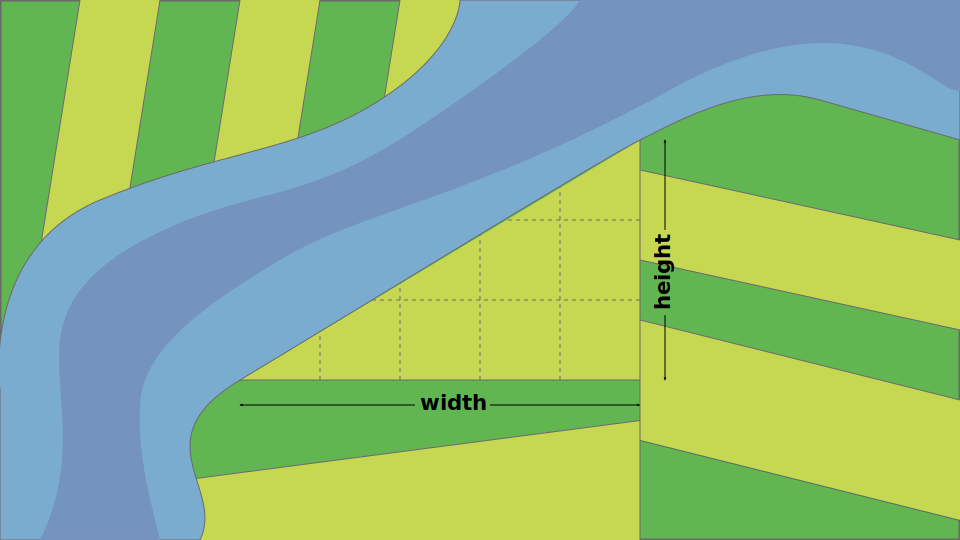

Funkce jsou jednou z nejdůležitějších součástí programování. Všimněte si, jak často vaše programy sestávají z volání různých funkcí. Ve všech programovacích jazycích je již od začátku mnoho funkcí rovnou k dispozici. Často ale potřebujeme funkci, která dělá něco specifického, důležitého pouze pro náš program. V takovém případě nám nezbývá, než si takovou funkci naprogramovat samí.

## Vstupy a tělo funkce

Představme si například, že vyměřujeme pozemek a chceme spočítat plochu pozemku, který má tvar pravoúhlého trojúhelníka o šířce `width` a výšce `height` jako na obrázku.



Naše funkce tedy bude mít dva vstupy - šířku a výšku. Ze školy si pamatujeme, že plochu prvoúhlého trojúhelníka spočítáme tak, že vynásobíme šířku výškou a výsledek vydělíme dvěma. Už tedy víme, co má funkce dělat a zbývá nám tento postup zapsat v JavaScritpu.

```js
(width, height) => {
  return (width * height) / 2;
};
```

Zápis funkce se dělí na definici <term cs="vstupů" en="inputs"> (před šipkou) a <term cs="tělo" en="body"> (za šipkou). Jako vstupy v kulatých závorkách vidíme dvě slova `width` a `height`. To jsou speciální proměnné, kterým říkáme <term cs="parametry" en="parameters">.

Ve složených závorkách pak máme takzvané tělo funkce. To obsahuje kód, který se má vykonat, když funkci zavoláme. Úkolem naší funkce je vrátit nějaký výsledek. Speciální slovíčko `return` proto říká, co má být výsledkem naší funkce.

Zbývá ukázat, jak naší funkci zavoláme. Zde přichází jedno z nejdůležitějších uvědomění, které v JavaScriptu kdy zažijete.

**Funkce je hodnota, podobně jako číslo nebo řetězec!**

Funkci můžeme uložit do proměnné stejně jako každou jinou hodnotu. Uložením do proměnné tak funkci dáme jméno. Všimněte si, že jde o stejný postup jako s jakoukoliv jinou hodnotou.

```js
const age = 25;
const user = 'robert';
const married = false;
const element = document.querySelector('.card');
const landArea = (width, height) => {
  return (width * height) / 2;
};
```

Jakmile máme funkci takto hezky uloženou v proměnné, můžeme jí zavolat známým způsobem.

```js
landArea(5, 3);
```

Jakmile funkci takto zavoláme, například s hodnotami 5 a 3, JavaScript tyto hodnoty uloží do parametrů `width` a `height` a v těle funkce pak parametry použjeme jako normální proměnné pro náš výpočet.

## Složitější funkce

Ne každá funkce je tak přímočará, jako výpočet obsahu. Často se stane, že potřebujeme ve funkci provést nějaké rozhodování, výpočet sestávají z více kroků apod. Mějme například funkci, která rozhodne, zda máme dostatečně bezpečné heslo. Heslo budeme považovat za bezpečné, pokud je delší než 12 znkaů. V takovéto funkci tedy potřebujeme použít podmínky. Tělo funkce proto bude obsahovat více příkazů, které se nám už nevejdou na jeden řádek. V takovém případě bude tělo funkce blok kódu podobně jako to už známe u podmínek.

```js
const isSafe = (password) => {
  if (password.length >= 12) {
    return true;
  } else {
    return false;
  }
};
```

Všimněte si, že v této funkci máme vícero slovíček `return`, protože funkce v různých situacích vrací různé výsledky. Ve chvíli, kdy JavaScript runtime při vykonává funkce narazí na `return`, vykonávání funkce se ukončí a program se vrací na místo, odkud byla funkce volána. Vrácená hodnota pak bude na tomto místě výsledkem naší funkce. Ten si pak můžeme uložit třeba do proměné.

```js
const result = isSafe('popokatepetl');
```

Vzhledem k tomu, že příkazem `return` se průběh funkce ukončuje, můžeme funkci `isSafe` napsat také takto.

```js
const isSafe = (password) => {
  if (password.length >= 12) {
    return true;
  }
  return false;
};
```

Proč není `else` potřeba? Zde je nuté oprášit logické uvažování. Pokud byla délka hesla dotatečná, funkce skončila u prvního `return` a k druhému se vůbec nedostala. Pokud se tedy vykonávání funkce dostalo až k druhému `return`, znamená to, heslo kontrolou neprošlo. Jinak by totiž funkce skončila mnohem dřív a sem bychom se vůbec nedostali. Nemusíme už tedy říkat žádné `else` a prostě vrátíme `false`.

Této strategii se říká <term cs="časný návrat" en="early return"> a zkušení programátoři jej používají velmi často. Je proto dobré si na tento způsob zápistu zvyknout už od samého začátku.

### Funkce bez parametrů

V praxi běžně narazíme také na funkce, které žádné parametry nemají. V takovém případě na místo parametrů píšeme prostě prázdné závorky. Příkladem může být následující funkce, která pro nás hodí kostkou, tedy vygeneruje náhodné celé číslo mezi 1 a 6.

```js
const roll = () => {
  return Math.floor(Math.random() * 6) + 1;
};
```

Tato funkce ke své činnosti žádné hodnoty z venku napotřebuje, proto je bez parametrů. Další příklad může být funkce, který obarví nadpis stránky na červeno.

```js
const colorHeadingRed = () => {
  const headingElm = document.querySelector('h1');
  headingElm.style.color = 'red';
};
```

Tato funkce parametry nemá, protože ke své činnosti opět nepotřebuje žádné informace z venku. Mohli bychom však také chtít funkci, která obarví nadpis námi zvolenou barvou. V takovém případě funkci přidáme jeden parametr.

```js
const colorHeading = (colorName) => {
  const headingElm = document.querySelector('h1');
  headingElm.style.color = colorName;
};
```

### Funkce bez návratové hodnoty

@exercises ## Cvičení - Vlastní funkce [

- obsah-elipsy
- maximum-ze-dvou
- ramecek
  ]@

@exercises ## Doporučené úložky na doma [

- python-round
  ]@

## Dobrovolné čtení na doma - alternativní zápis funkcí

V různých výukových materiálech se můžete setkat s alternativním zápisem funkce. Ten by pro naši obarvovací funkci vypadal takto.

```js
function colorHeading(colorName) {
  const headingElm = document.querySelector('h1');
  headingElm.style.color = colorName;
}
```

Mezi těmito dvěma zápisy jsou co do významu drobné rozdíly. V tuto chvíli však ještě nemáme dostatečný aparát k tomu, abychom dobře vysvětlili, v čem přesně rozdíly mezi takto zapsanými funkcemi spočívají. Navíc v žádném tématu probíraném v rámci celé akademie se rozdíly mezi těmito zápisy neprojeví. Pro účely našeho kurzu tedy stačí si vybrat jeden zápis a toho se držet. My si vybereme ten první, kterému se odborně říká _arrow funkce_. Výhody tohoto zápisu spočívají v tom, že

1. názorně ukazuje, že funkce se ukládá do proměnné, a je to tedy hodnota jako každá jiná,
2. arrow funkce fungují uvnitř jednodušeji než funkce zapsané pomocí `function`,
3. zápis arrow funkcí je většinou kratší a méně ukecaný.
